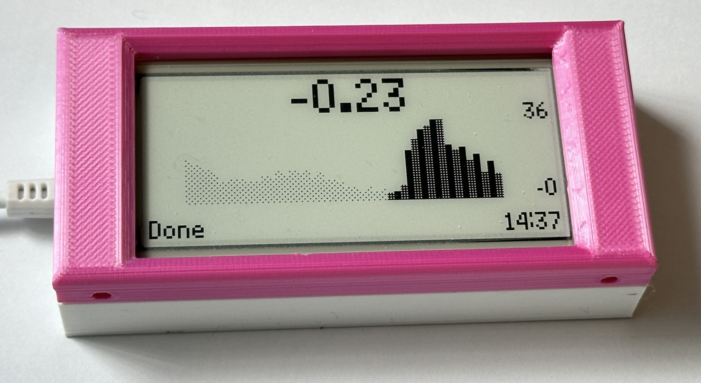

# PICO Agile Octopus Display

The display shows the Agile Octopus prices for the day. 

# Getting Started
You will need a PICO-W device and a display. The code is written for the [Pimoroni e-ink](https://shop.pimoroni.com/products/pico-inky-pack) or [Pimoroni LCD](https://shop.pimoroni.com/products/pico-gfx-pack) devices. 
## Firmware Installation
Your PICO-W must be running the Pimoroni MicroPython image. You can find the version used for this project in the firmware project. Hold down the BOOTSEL button down on your PICO-W, plug it into your computer and then drag the image file onto the hard drive that appears.
## Sofware Installation
Once you have installed the firmware you can use the [Thonny program](https://thonny.org/)  to copy the main.py program onto the display. 
## Software configuration

You will need to configure the display. You can use the online configuration tool to do this. Leave the PICO plugged into your computer and visit the page [https://pico-agile-octopus-display.github.io/config.github.io/](https://pico-agile-octopus-display.github.io/config.github.io/) 

Visit the web page, connect your display to a serial port and then click the "Display Plugged in" button.

Select your device in the menu that appears and click "Connect". The web page will connect to the display and read the settings from it for you to edit.

When you've entered the setting values click "Submit" to send the values back into the display.

When this page is displayed your device has been configured. It will reset but it might not connect correctly. Unplug it and plug it back in if you have this problem. 

If you select the wrong display type you might find that your display gets stuck. In that case plug the display into your computer and use Thonny to modify the settings.json file, or delete the file and you can then re-configure your device.

# Display versions

The software will work with these two displays.

# Case Design
You can find the designs for the case in the case folder on this site.

Have fun!

Rob Miles
